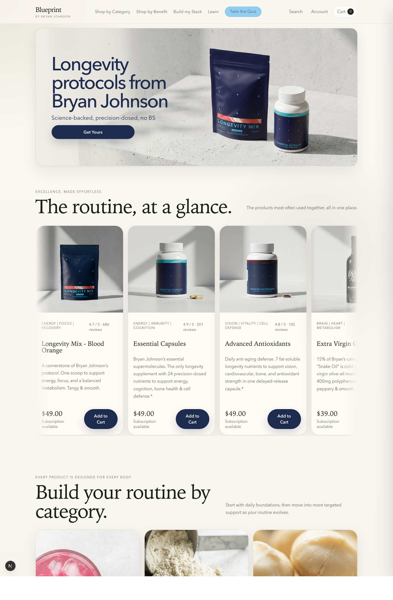
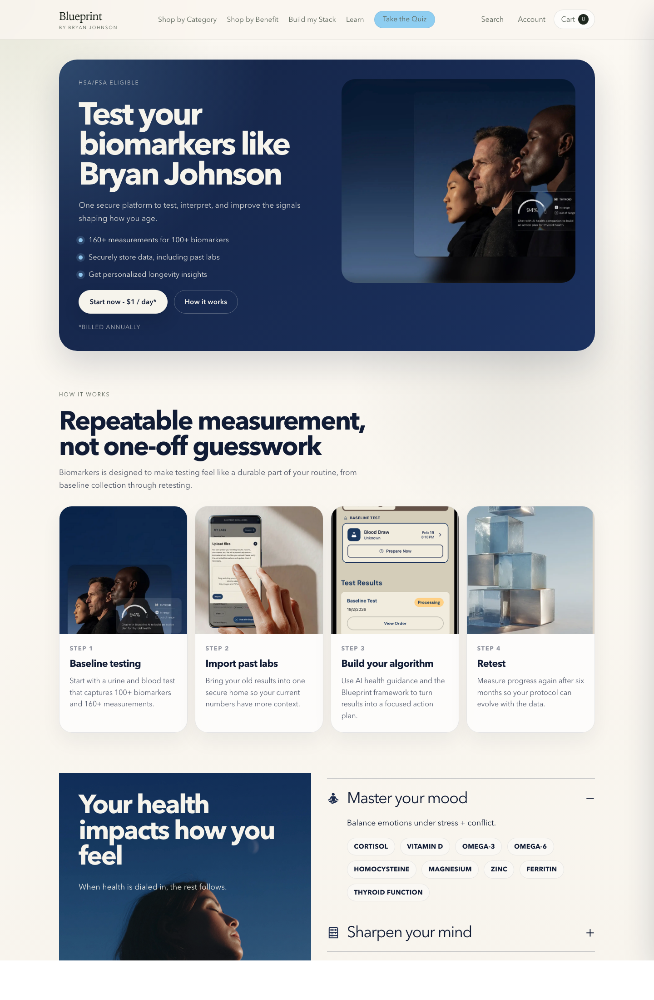
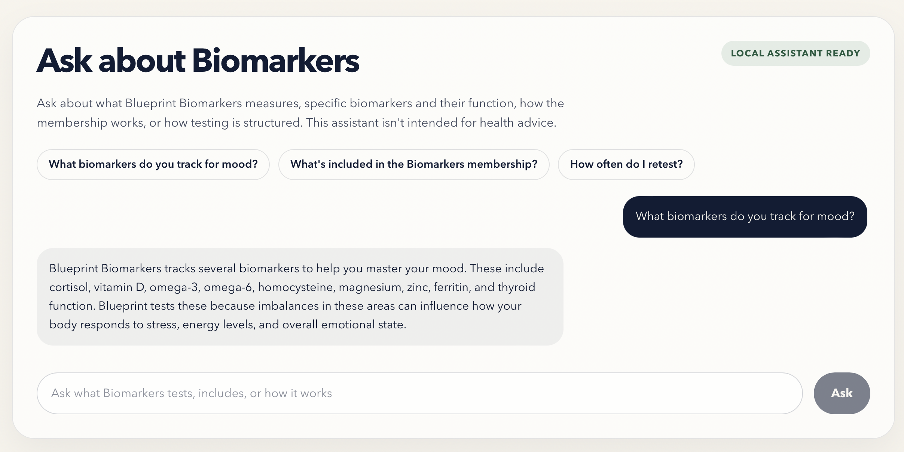
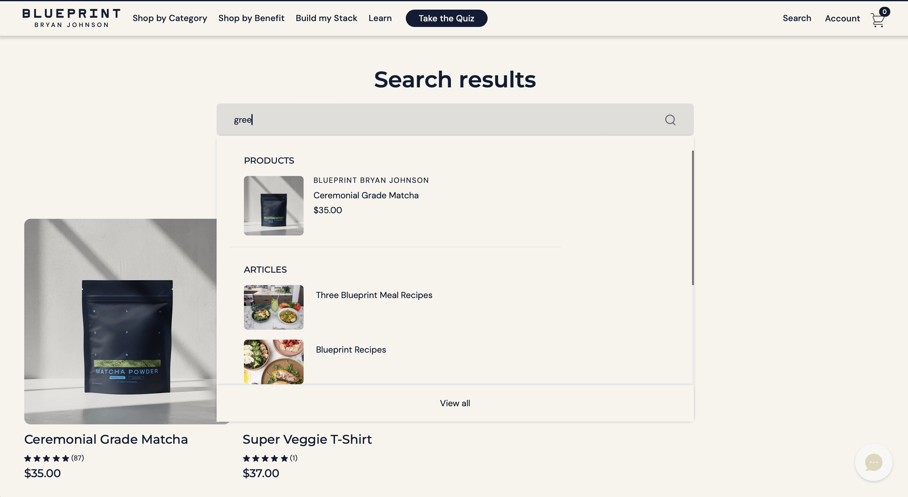
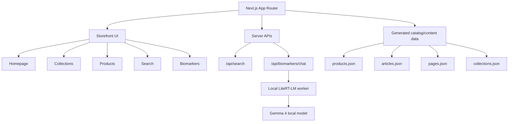
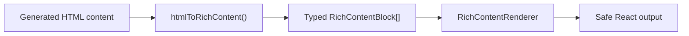
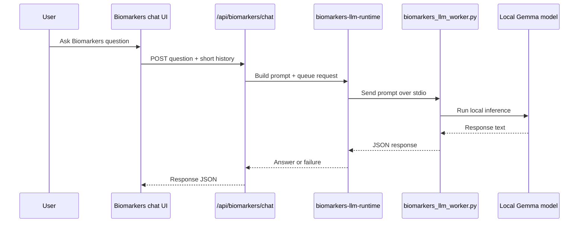

# Blueprint Storefront

Blueprint is copyright Bryan Johnson. All work here is derivative and a POC for an interview application. NONE of this is officially affiliated with Bryan Johson or any of his associated names, works, companies, etc. 

The following is a custom storefront rebuilt in **Next.js 15**, **React 19**, and **TypeScript** with a native app architecture, server-backed search, rich content rendering, a local Biomarkers assistant, and a full set of mocked commerce flows for local development.

The active application lives in [`storefront-next/`](./storefront-next). This README is intentionally focused on that app and the system we built around it.

## Screenshots

### Homepage



### Biomarkers



### Biomarkers Chat



### Search



## What this app includes

- A bespoke homepage with custom sections, carousels, mega menus, editorial blocks, and newsletter capture
- Collection pages with benefit filters, sort controls, custom product cards, and in-grid promo modules
- Product detail pages with media galleries, local cart integration, and subscription-aware purchase flows
- Search with empty state, live suggestions, and server-backed results
- Mocked cart and account flows for local development
- Native rich-content rendering for articles, CMS pages, and COA content
- A fully custom Biomarkers landing page, FAQ experience, and **local-only** LLM assistant
- Security, performance, and scalability hardening for local-first development and safe repo sharing

## App map



## Route coverage

The app currently ships these key surfaces:

- `/`
- `/collections/[collectionHandle]`
- `/products/[handle]`
- `/blogs/[blog]`
- `/blogs/[blog]/[slug]`
- `/pages/[handle]`
- `/pages/biomarkers`
- `/pages/build-my-stack`
- `/pages/coas`
- `/pages/coa-staging`
- `/pages/protocol-quiz`
- `/cart`
- `/account`
- `/search`

## Tech stack

- **Framework:** Next.js 15 App Router
- **UI:** React 19
- **Language:** TypeScript
- **Testing:** Vitest
- **Linting:** ESLint 9
- **HTML parsing / content transform:** `parse5`
- **AI / local inference UI:** custom local worker integration with Google LiteRT-LM-compatible workflow

## Repository structure

The active implementation is under [`storefront-next/`](./storefront-next):

```text
storefront-next/
├── app/
│   ├── api/
│   │   ├── biomarkers/chat/route.ts
│   │   └── search/route.ts
│   ├── account/
│   ├── blogs/
│   ├── cart/
│   ├── collections/
│   ├── pages/
│   ├── products/
│   ├── search/
│   ├── globals.css
│   └── layout.tsx
├── components/
│   ├── home-page.tsx
│   ├── biomarkers-page.tsx
│   ├── biomarkers-llm-assistant.tsx
│   ├── cart-drawer.tsx
│   ├── cart-page-view.tsx
│   ├── search-experience.tsx
│   ├── rich-content-renderer.tsx
│   └── ...
├── lib/
│   ├── storefront.ts
│   ├── rich-content.ts
│   ├── biomarkers-assistant.ts
│   ├── biomarkers-llm-runtime.ts
│   ├── subscription-eligibility.ts
│   └── ...
├── public/
│   ├── media/
│   └── cdn/
├── data/generated/
├── scripts/
│   ├── asset-inventory.mjs
│   └── biomarkers_llm_worker.py
└── .github/workflows/ci.yml
```

## Architecture

### 1. App Router + descriptive route modules

We kept Next’s required `page.tsx` entrypoints, but route logic lives in descriptive sibling files such as:

- [`storefront-next/app/home-route.tsx`](./storefront-next/app/home-route.tsx)
- [`storefront-next/app/search/search-route.tsx`](./storefront-next/app/search/search-route.tsx)
- [`storefront-next/app/pages/biomarkers/biomarkers-route.tsx`](./storefront-next/app/pages/biomarkers/biomarkers-route.tsx)

That keeps the file system compatible with Next while making the implementation easier to navigate.

### 2. Shared storefront data layer

[`storefront-next/lib/storefront.ts`](./storefront-next/lib/storefront.ts) is the main data access layer. It:

- loads generated catalog and content JSON lazily
- provides route-facing helpers like `getProductByHandle`, `getProductsForCollection`, `getArticle`, `getPageByHandle`, and `searchCatalog`
- rewrites and localizes asset references
- normalizes rich content into render-safe block data

### 3. Typed rich-content rendering

Rather than injecting source HTML directly into the UI, the app converts content into typed blocks and renders it through React.



Core files:

- [`storefront-next/lib/rich-content.ts`](./storefront-next/lib/rich-content.ts)
- [`storefront-next/components/rich-content-renderer.tsx`](./storefront-next/components/rich-content-renderer.tsx)
- [`storefront-next/lib/types.ts`](./storefront-next/lib/types.ts)

Supported block types include:

- headings
- paragraphs
- lists
- links
- images
- quotes
- tables
- controlled Instagram-style embed fallback blocks

### 4. Local state layer

[`storefront-next/components/storefront-provider.tsx`](./storefront-next/components/storefront-provider.tsx) provides:

- cart state
- cart drawer open/close state
- subscription toggles
- account mock state

Local persistence is:

- versioned
- TTL-based
- validated on read
- self-healing when stale or malformed

## Biomarkers AI assistant

The Biomarkers page includes a **local-only** assistant that runs against a Gemma model on the developer machine.

### How it works



### Assistant behavior

The assistant is intentionally constrained:

- answers questions about Blueprint Biomarkers
- can discuss specific biomarkers Blueprint tests
- can explain what a biomarker does in general
- can explain why a biomarker matters as a health indicator
- refuses personalized medical advice
- refuses treatment plans and individualized interpretation
- fails closed to the `Your health impacts how you feel` section if the local model is unavailable

Relevant files:

- [`storefront-next/components/biomarkers-llm-assistant.tsx`](./storefront-next/components/biomarkers-llm-assistant.tsx)
- [`storefront-next/lib/biomarkers-assistant.ts`](./storefront-next/lib/biomarkers-assistant.ts)
- [`storefront-next/app/api/biomarkers/chat/route.ts`](./storefront-next/app/api/biomarkers/chat/route.ts)
- [`storefront-next/lib/biomarkers-llm-runtime.ts`](./storefront-next/lib/biomarkers-llm-runtime.ts)
- [`storefront-next/lib/biomarkers-runtime-config.ts`](./storefront-next/lib/biomarkers-runtime-config.ts)
- [`storefront-next/scripts/biomarkers_llm_worker.py`](./storefront-next/scripts/biomarkers_llm_worker.py)

### Local runtime configuration

The assistant uses environment-aware local runtime configuration:

- `BIOMARKERS_MODEL_PATH`
- `BIOMARKERS_PYTHON_PATH`
- `BIOMARKERS_WORKER_BACKEND`

Defaults are resolved in [`storefront-next/lib/biomarkers-runtime-config.ts`](./storefront-next/lib/biomarkers-runtime-config.ts).

## Search

Search is now server-backed rather than shipping the entire catalog corpus to the browser.

### UX

- empty state with Bryan’s favorites
- live typeahead suggestions
- split suggestions for products and articles
- dedicated results page for `/search?q=...`

### Implementation

- [`storefront-next/app/search/search-route.tsx`](./storefront-next/app/search/search-route.tsx)
- [`storefront-next/components/search-experience.tsx`](./storefront-next/components/search-experience.tsx)
- [`storefront-next/app/api/search/route.ts`](./storefront-next/app/api/search/route.ts)
- [`storefront-next/lib/storefront.ts`](./storefront-next/lib/storefront.ts)

## Media strategy

The app uses a mixed local-media strategy:

- curated app-owned assets in `public/media`
- required storefront content assets in `public/cdn`
- optimized rendering via [`storefront-next/components/optimized-image.tsx`](./storefront-next/components/optimized-image.tsx)

We also added an inventory script to keep asset growth visible:

- [`storefront-next/scripts/asset-inventory.mjs`](./storefront-next/scripts/asset-inventory.mjs)

Run it with:

```bash
cd storefront-next
npm run assets:inventory
```

## Security and hardening

The app includes a number of hardening changes:

- CSP, referrer, frame, and permissions headers in [`storefront-next/next.config.mjs`](./storefront-next/next.config.mjs)
- `poweredByHeader: false`
- local-only enforcement for the Biomarkers chat route
- queue-based worker control for local inference
- removal of the old model-download HTTP path
- rich-content rendering instead of direct raw HTML injection
- versioned localStorage envelopes with validation and expiry

## Testing

The repo now has a compact smoke-test layer intended to catch obvious breakage.

### Test commands

```bash
cd storefront-next
npm run lint
npm run typecheck
npm run test
npm run build
```

### Build behavior

`npm run build` automatically runs the test suite first via:

```json
"prebuild": "npm run test"
```

### Current test coverage

- [`storefront-next/lib/rich-content.test.ts`](./storefront-next/lib/rich-content.test.ts)
  - safe content transformation
  - embed fallback transformation
  - plain-text extraction
- [`storefront-next/lib/biomarkers-assistant.test.ts`](./storefront-next/lib/biomarkers-assistant.test.ts)
  - assistant guardrails
  - alias normalization
  - fallback behavior
- [`storefront-next/lib/subscription-eligibility.test.ts`](./storefront-next/lib/subscription-eligibility.test.ts)
  - merch/device subscription exclusion
- [`storefront-next/lib/storefront.test.ts`](./storefront-next/lib/storefront.test.ts)
  - stable catalog search
  - stable article search
  - collection sorting

## CI

GitHub Actions runs the verification pipeline on pushes and pull requests:

- lint
- typecheck
- test
- build
- dependency audit

See [`storefront-next/.github/workflows/ci.yml`](./storefront-next/.github/workflows/ci.yml).

## Local development

### 1. Install dependencies

```bash
cd storefront-next
npm install
```

### 2. Start the dev server

```bash
npm run dev -- --port 3001
```

Open:

- [http://127.0.0.1:3001](http://127.0.0.1:3001)

### 3. Optional local Biomarkers assistant setup

The Biomarkers assistant expects:

- a local LiteRT-LM-compatible Python environment
- a local Gemma model file

If the model or runtime is unavailable, the page still works and the assistant falls back gracefully.

## Key implementation areas

### Homepage

- [`storefront-next/components/home-page.tsx`](./storefront-next/components/home-page.tsx)
- [`storefront-next/components/bestsellers-carousel.tsx`](./storefront-next/components/bestsellers-carousel.tsx)
- [`storefront-next/components/routine-carousel.tsx`](./storefront-next/components/routine-carousel.tsx)
- [`storefront-next/components/standards-feature.tsx`](./storefront-next/components/standards-feature.tsx)
- [`storefront-next/components/newsletter-signup.tsx`](./storefront-next/components/newsletter-signup.tsx)

### Navigation

- [`storefront-next/components/header.tsx`](./storefront-next/components/header.tsx)
- [`storefront-next/components/hero-category-menu.tsx`](./storefront-next/components/hero-category-menu.tsx)
- [`storefront-next/components/header-benefit-menu.tsx`](./storefront-next/components/header-benefit-menu.tsx)
- [`storefront-next/components/footer.tsx`](./storefront-next/components/footer.tsx)

### Commerce flows

- [`storefront-next/components/product-purchase-card.tsx`](./storefront-next/components/product-purchase-card.tsx)
- [`storefront-next/components/cart-drawer.tsx`](./storefront-next/components/cart-drawer.tsx)
- [`storefront-next/components/cart-page-view.tsx`](./storefront-next/components/cart-page-view.tsx)
- [`storefront-next/components/storefront-provider.tsx`](./storefront-next/components/storefront-provider.tsx)

### Editorial and CMS

- [`storefront-next/components/article-page-view.tsx`](./storefront-next/components/article-page-view.tsx)
- [`storefront-next/components/cms-page-view.tsx`](./storefront-next/components/cms-page-view.tsx)
- [`storefront-next/components/coas-page.tsx`](./storefront-next/components/coas-page.tsx)
- [`storefront-next/components/rich-content-renderer.tsx`](./storefront-next/components/rich-content-renderer.tsx)

### Biomarkers

- [`storefront-next/components/biomarkers-page.tsx`](./storefront-next/components/biomarkers-page.tsx)
- [`storefront-next/components/biomarkers-health-impacts.tsx`](./storefront-next/components/biomarkers-health-impacts.tsx)
- [`storefront-next/components/biomarkers-faq.tsx`](./storefront-next/components/biomarkers-faq.tsx)
- [`storefront-next/components/biomarkers-llm-assistant.tsx`](./storefront-next/components/biomarkers-llm-assistant.tsx)

## Notes

- The Biomarkers assistant is designed for **local development**, not public deployment in its current form.
- The app intentionally prefers **safe typed content rendering** over perfect source-page fidelity for long-tail content.
- Some large static assets remain in the repo because they are still referenced by active pages.

## Quick start summary

```bash
cd storefront-next
npm install
npm run dev -- --port 3001
```

Then verify the app with:

```bash
npm run lint
npm run typecheck
npm run test
npm run build
```
